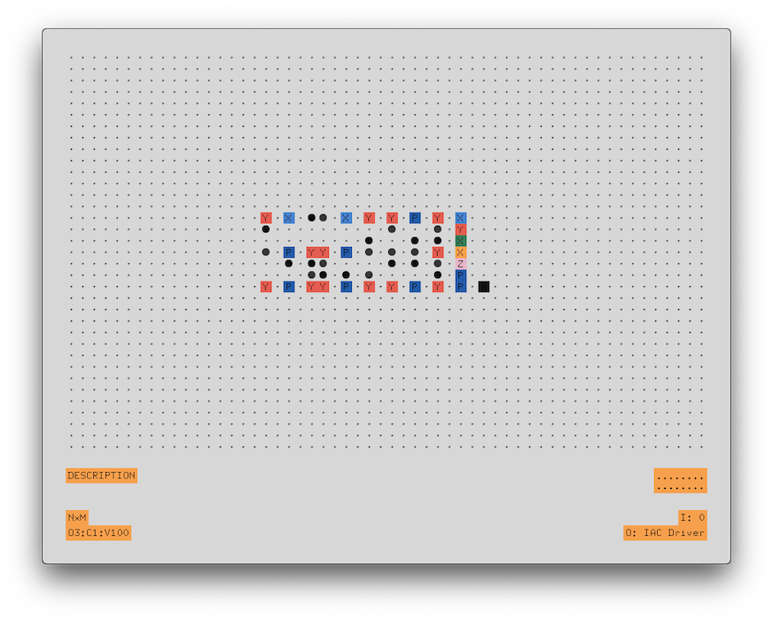

# Ensemble (WIP)

Ensemble is a MIDI sequencer for macOS, using [openFrameworks](https://github.com/openframeworks/openFrameworks) and [ofxMidi](https://github.com/danomatika/ofxMidi).

Ensemble can use both an internal clock and an external MIDI clock.

